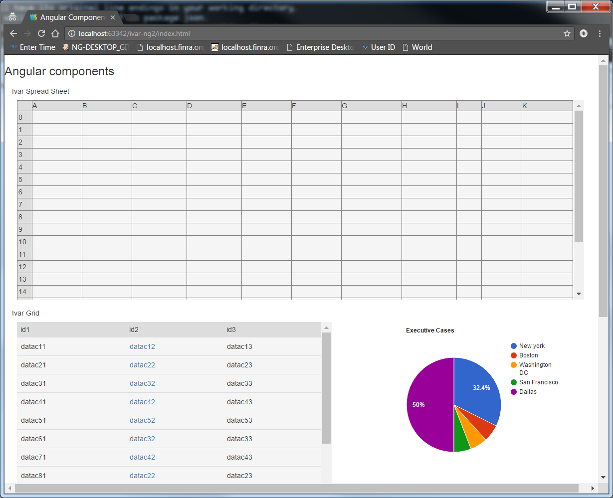

# IVAR Angular 2 componets
[![Build Status][travis-badge]][travis-badge-url]

This repository holds the few of generic angular2 components.

**Generic angular 2 components**

##IVAR GRID
##IVAR CHART
##IVAR SPREAD SHEET



## Prerequisites

Node.js and npm are essential to Angular development. 
    
<a href="https://docs.npmjs.com/getting-started/installing-node" target="_blank" title="Installing Node.js and updating npm">
Get it now</a> if it's not already installed on your machine.
 
**Verify that you are running at least node `v4.x.x` and npm `3.x.x`**
by running `node -v` and `npm -v` in a terminal/console window.
Older versions produce errors.

We recommend [nvm](https://github.com/creationix/nvm) for managing multiple versions of node and npm.

## Create a new project based on the QuickStart

Clone this repo into new project folder (e.g., `my-proj`).
```bash
git clone  https://github.com/ravicoding/ivar-ng2  my-proj
cd my-proj
```

## Install npm packages

> See npm and nvm version notes above

Install the npm packages described in the `package.json` and verify that it works:

**Attention Windows Developers:  You must run all of these commands in administrator mode**.

```bash
npm install
npm start
```

> If the `typings` folder doesn't show up after `npm install` please install them manually with:

> `npm run typings -- install`

The `npm start` command first compiles the application, 
then simultaneously re-compiles and runs the `lite-server`.
Both the compiler and the server watch for file changes.

Shut it down manually with Ctrl-C.

